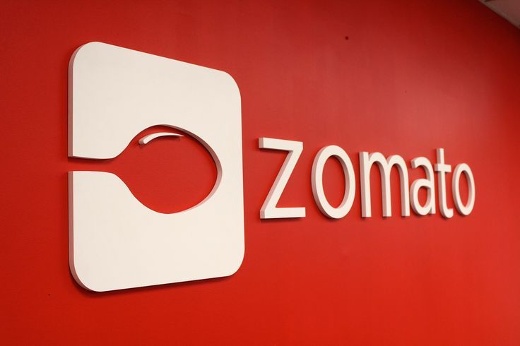

# Zomato-Restaurant-Rate-Prediction

You can find blog related to this case study from [here](https://medium.com/@pranaysawant22/zomato-restaurant-rate-prediction-2093cb685430).

## 1. Business Problem

## 1.1 Problem Description

Restaurants from all over the world can be found here in Bengaluru. From United States to Japan, Russia to Antarctica, you get all type of cuisines here. Delivery, Dine-out, Pubs, Bars, Drinks,Buffet, Desserts you name it and Bengaluru has it. Bengaluru is best place for foodies. The number of restaurant are increasing day by day. Currently which stands at approximately 12,000 restaurants. With such an high number of restaurants. This industry hasn't been saturated yet. And new restaurants are opening every day. However it has become difficult for them to compete with already established restaurants. The key issues that continue to pose a challenge to them include high real estate costs, rising food costs, shortage of quality manpower, fragmented supply chain and over-licensing. This Zomato data aims at analysing demography of the location. Most importantly it will help new restaurants in deciding their theme, menus, cuisine, cost etc for a particular location. It also aims at finding similarity between neighborhoods of Bengaluru on the basis of food. 

- Does demography of area matters?
- Does location of particular type of restraurant depends on people living in that area>
- Does theme of restraurant matters?
- Is food chain category restraurant likely to have more customers than its counter part?
- Are any neighbourhood on similar based on the type of food?
- Is particular neighbours is famous for itw own kind of food?
- If two neighbours are similar does that mean these are related or particular group of people live in neighbourhood or these are places to eat.
- What kind of food is famous in locality.
- Do entire locality loves veg food, if yes then locality populated by particular set of people eg Jain, Gujarati,Marwadi who are basically veg.

## 1.2 Problem Statement

The dataset also contains reviews for each of the restaurant which will help in finding overall rating for the place. So we will try to predict rating for particular restaurant.

## 1.3 Real world/Business Objectives

We need to predict rating based on different parameters like Average_cost for two people, Online Order available, foods,menu list, most liked dishes etc features.

## 1.4 Machine Learning Formulation
Here we suppose to predicted rating of restaurant, so it is basically **Regression** problem.

## 1.5 Perfomance Metric
We will try to reduce Mean Square Error ie **MSE** as minimum as possible. So it is **Regression** problem reducing **MSE**.
- Ideal MSE is 0.

## 2. Data Acquire:
aource : https://www.kaggle.com/himanshupoddar/zomato-bangalore-restaurants

## Model Compare

|                      Model                      |    MSE    |
|  ---------------------------------------------- | --------- |
|         Random Model                            | 2.12      |
|         SGD Regressor 7 ONEHOT Features         | 8.091e+30 |
|      SGD Regressor Response coded Features      | 6.926e+29 |
|         SGD Regressor 5 ONEHOT Features         | 2.069e+28 |
|       Linear Regression 5 ONEHOT Features       |   0.1278  |
|    Random Forest Regressor 5 ONEHOT Features    |  0.03485  |
|       Linear Regression 7 ONEHOT Features       |  0.04308  |
|    Random Forest Regressor 7 ONEHOT Features    |  0.01404  |
|    Linear Regression Response coded Features    |  0.00948  |
| Random Forest Regressor Response coded Features |  0.00353  |
|     NLP Feature - BoW Random Forest Regressor     |  0.045  |
|                 NLP Feature - LSTM                |   0.05  |
|                 NLP Feature - GRU                 |  0.044  |
|                  All features NN                  |  0.106  |

